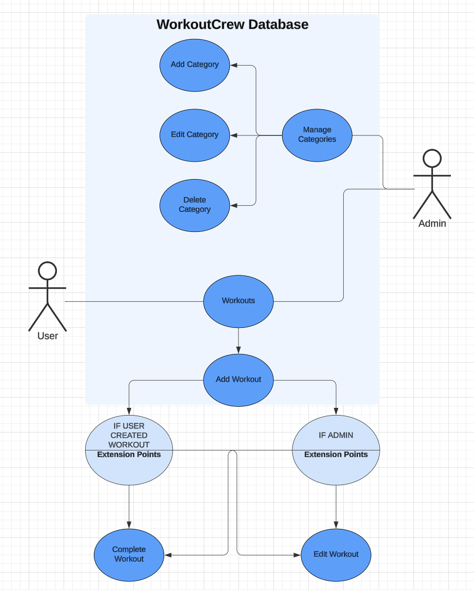

# [WorkoutCrew](https://workout-project3-8b4d937e7508.herokuapp.com/ "Click to view the deployed site")

- WorkoutCrew is an online database for users to search and submit exercises.
- WorkoutCrew has been designed for users who have an interest in fitness.
- WorkoutCrew is for users who may not be fully knowledgable in exercises and can use the database for inspiration.
- WorkoutCrew displays each exercise detailing the body that is targeted, the exercises to complete and when to complete it.
- WorkoutCrew is especially useful for Personal Trainers to create an exercise plan for clients who can then access the exercises and go in with a plan tailored to them.
- WorkoutCrew allows users to select multiple categories targeting multiple areas of fitness.
- WorkoutCrew is visually designed for those identifying as female but the functionality is suitable for everyone.

## Table of Contents

<details>
<summary>Click here for Table of Contents</summary>

[Mockup Screenshots](#mockup-screenshots)

[UX](#ux)

- [Colour Scheme](#colour-scheme)
- [Typography](#typography)

[User Stories](#user-stories)

- [New site Users](#new-site-users)
- [Returning Site Users](#returning-site-users)
- [Use Case Diagram](#use-case-diagram)
- [Database Schema] (#database-schema)

[Wireframes](#wireframes)

[Features](#features)

- [Existing Features](#existing-features)
- [Future Features](#future-features)

[Testing](#testing)

[Deployment](#deployment)

[Credits](#credits)

- [Content and Code](#content-and-code)

- [Acknowledgments](#acknowledgements)

</details>

## Mockup Screenshots

Below is a mockup image of the WorkoutCrew application created using the "Am I Responsive" website.

| Screenshot 1 |
| :---: |
|  |

## UX

- The design for WorkoutCrew was created as a series of wireframes covering mobile, tablet and desktop to determine the initial design and layout of the site.
- WorkoutCrew is designed to be simple and easy to navigate using standard user conventions.
- The application displays all workouts on the homepage to the signed in user and features a search bar at the top to search the database with ease.

### Colour Scheme

- I decided to go with a pink colour scheme which is typical of female targeted products. Different complementing tones of pink feature whilst white has been used for all form related function. Simple black and white text has been used to contrast the pink for easier reading/navigating.
- The colours used are as follows:-

- `#ffffff` used for primary text.
- `#880e4f` used for the header, footer, card panels and icons.
- `#000000` used for secondary text and edit buttons.
- `#20b2aa` used for 'done' button.
- `#0, 0, 0, 0.5` used for text shadows.

I have used CSS `:root` variables to easily update the global colour scheme by changing only one value, instead of everywhere in the CSS file.

```css
:root {
    --dark-pink: #880e4f;
    --light-pink: #ffe6ee;
    --light-green: #20b2aa;
    --black: #000;
    --white: #fff;
}
```

### Typography

- I used the Google Font called 'Special Elite' for the WorkoutCrew site.
- I wanted a typewriter element to match the feeling of 'inputting of data' to a database.

- [Special Elite](https://fonts.google.com/specimen/Special+Elite) was used for all text within the site.

- [Font Awesome](https://fontawesome.com) icons were used in the WorkoutCrew site.

## User Stories

### New Site Users

- As a new site user, I would like to know what the site is about, so that I understand what the site does.
- As a new site user, I would like to search the database for exercises.
- As a new site user, I would like to search the database for body parts (targeted exercises)
- As a new site user, I would like to search categories that exist as well as add new workouts.
- As a new site user, I would like to have an overview of the upcoming workouts.

### Returning Site Users

- As a returning site user, I would like to search the database for specific exercises.
- As a returning site user, I would like to be able to change/edit/delete the workouts I have added.
- As a returning site user, I would like to be able to sign in with ease.

### Use Case Diagram
| UML Use Case Diagram |
| :---: |
|  | 

### Database Schema
| Database Schema |
| :---: |
|  | 

## Wireframes

| Main page |
| :---: |
|  | 


## Features

### Existing Features

| Feature | Description | Screenshot |
| :---: | :---: | :---: |
| **Popout Dropdowns** | The popout dropdowns on the homepage display each workout with the category, exercises and date. If the owner of the workout is logged in, they have the option to edit/delete that workout. |  |
| **Search Box** | The search box is located at the top of the main page for users to be able to search the database with specific queries. They can search for categories and specific exercises. |  |
| **Card Panel Categories** | Admin users can access/manage the categories that users can select when adding a workout to the database. |  | !
| **Edit/ Delete Buttons** | The card panel categories (controlled by admin) also have the option for editing/deleting. |  |
| **Register Form** | The application features a register form so users can access the content and add to the workouts. |  |
| **Login Form** | There is a login form for returning users to login and access the workouts. |  |
| **Add Workout Form** | Users are able to create and add their own workouts which others can view. |  |

### Future Features

- Images & Videos of Exercises
  - A feature to show users how to execute the exercises if they are unsure.
- Grouping Users
  - A feature that will group users together (eg. an exercise class) so they can access specific content.
- Personal Trainer User Accounts
  - A feature for Personal Trainers to tailor specific programs for their clients/groups.
- Modals to open when a user clicks to delete a workout.
  - A feature to prevent users from accidentally deleting a workout. (Attempted to code this into the application but would not function correctly.)
- A switch for users to state whether they are going for a PR.
  - A feature so that users can see if they are planning on attempting a PR. (Attempted to code this into the application but would not function correctly.)


## Tools & Technologies Used

- [HTML](https://en.wikipedia.org/wiki/HTML) used for the main site content.
- [CSS](https://en.wikipedia.org/wiki/CSS) used for the main site design and layout.
- [CSS :root variables](https://www.w3schools.com/css/css3_variables.asp) used for reusable styles throughout the site.
- [JQuery](https://www.jquery.com) used for user interaction on the site.
- [GitHub](https://gitpod.io) used for secure online code storage.
- [Heroku](https://heroku.com) used for hosting the deployed front-end site.
- [Flaticon](https://www.flaticon.com/) used for the favicon.
- [Google Fonts](https://fonts.google.com/) used to search a suitable font and obtain a download link for that font.
- [Font Awesome](https://fontawesome.com/) used to add GitHub icon to the footer and modal and search icon to the search button.

## Testing

For all testing, please refer to the [TESTING.md](TESTING.md) file.

## Deployment

The site was deployed to Heroku. The steps to deploy are as follows:

- After pushing all content to the repository, navigate to Heroku.
- In the [Heroku Dashboard](https://heroku.com/dashboard), navigate to the Project that you're working on.
- Click on the 'Deploy' button located near the top left of the page.
- Deployment method: Github > then select the repository to connect to.
- Enable automatic deploys.
- Deploy branch.

The live link can be found [here](https://workout-project3-8b4d937e7508.herokuapp.com/).

## Credits

The following are credits to various people and technologies that have directly or otherwise assisted in the creation of the WorkoutCrew site.

### Content and Code

| Source | Purpose | Notes |
| --- | --- | --- |
| [Code Institute](https://codeinstitute.net) | Main Application | Walkthrough used as a guide to create application. |
| [borderg](https://github.com/boderg/your-weather/blob/main/README.md) | README and TESTING| Used as a template for README and TESTING |
| [Github](https://www.github.com) | Repository | Used to store work in repository. |
| [Gitpod](https://www.gitpod.io) | Code Creation | Used to develop and write the application. |
| [Heroku](https://www.heroku.com) | Deployment | Used to deploy the application. |
| [MongoDB](https://www.mongodb.com) | Database | Used database to store, add, edit and update data. |
| [Flaticon](https://www.flaticon.com/free-icons/sports-and-competition) | Favicon | Used as the favicon for the application. |
| [Udacity](https://www.udacity.com/blog/2021/03/creating-an-html-404-error-web-page.html) | 404 Page | Used to create an Error 404 page. |
| [LucidChart](https://www.lucid.app) | README | Used to create a Use Case & Database Schema Diagram. |

### Acknowledgements

- I would like to thank Rebecca and Alan (Code Institute Tutors), for assisting me in fixing some big issues I was having with the application.
- I would like to thank Ethan, for trying his hardest in helping me with issues I was having with the code.
- I would like to thank Kim Holmes, for providing me with a lovely space to work in Panama during this project.
