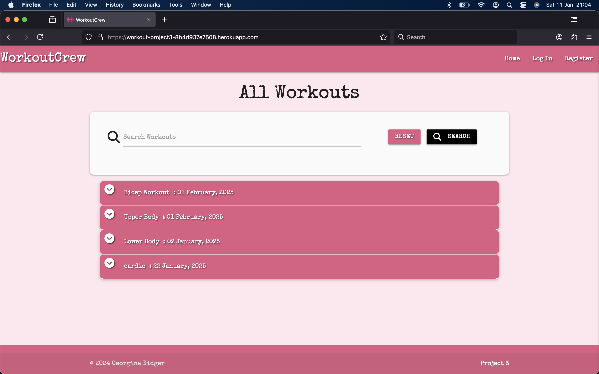
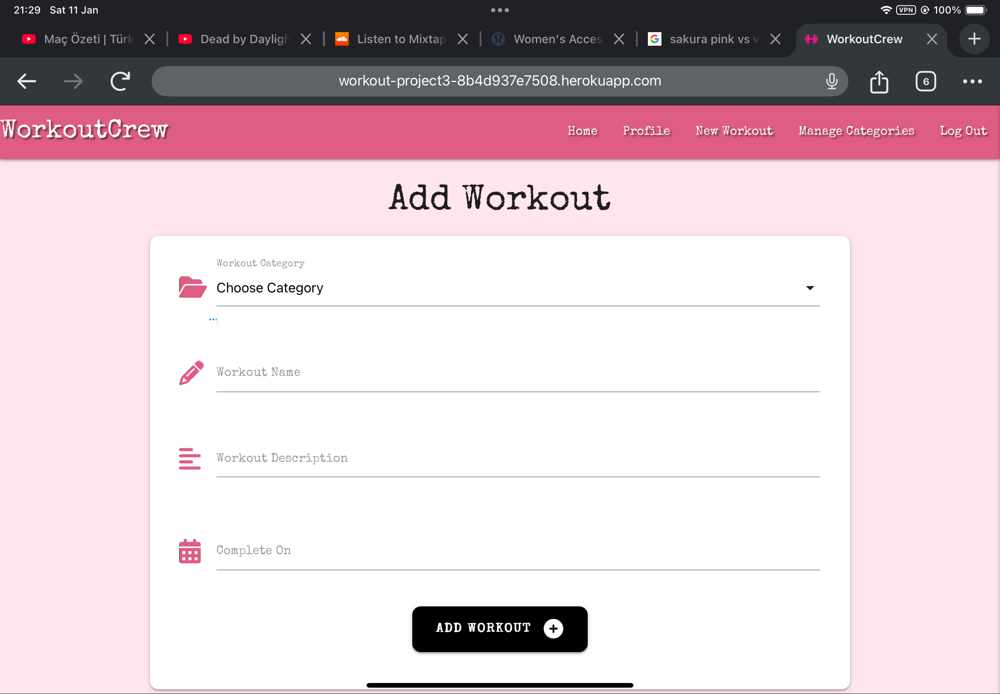

# Testing

Return back to the [README.md](README.md) file.

## Table of Contents

Click here for Table of Contents

- [Code Validation](#code-validation)
  - [HTML](#html)
  - [CSS](#css)
  - [JavaScript](#javascript)

- [Browser Compatibility](#browser-compatibility)

- [Responsiveness](#responsiveness)

- [Defensive Programming](#defensive-programming)

- [User Story Testing](#user-story-testing)

## Code Validation

### HTML

I have used the recommended [HTML W3C Validator](https://validator.w3.org) to validate all of my HTML files.
The validator picked up the ame error for all pages tested, this is due to using Jinja templating.

| Page | W3C URL | Screenshot | Notes |
| :---: | :---: | :---: | :---: |
| add_category | [W3C](https://workout-project3-8b4d937e7508.herokuapp.com/add_category) |  | Section lacks header h2-h6 warning |
| add_workout| [W3C](https://workout-project3-8b4d937e7508.herokuapp.com/add_workout) |  | Section lacks header h2-h6 warning|
| base | [W3C]() |  | Section lacks header h2-h6 warning |
| get_categories | [W3C](https://workout-project3-8b4d937e7508.herokuapp.com/get_categories) |  | Section lacks header h2-h6 warning |
| edit_category | [W3C](https://workout-project3-8b4d937e7508.herokuapp.com/edit_category) |  | Section lacks header h2-h6 warning |
| edit_workout| [W3C](https://workout-project3-8b4d937e7508.herokuapp.com/edit_workout) |  | Section lacks header h2-h6 warning |
| login | [W3C](https://workout-project3-8b4d937e7508.herokuapp.com/login) |  | Section lacks header h2-h6 warning |
| register | [W3C](https://workout-project3-8b4d937e7508.herokuapp.com/register) |  | Section lacks header h2-h6 warning |
| tasks | [W3C](https://workout-project3-8b4d937e7508.herokuapp.com/get_tasks) |  | Section lacks header h2-h6 warning |

### CSS

I have used the recommended [CSS Jigsaw Validator](https://jigsaw.w3.org/css-validator) to validate all of my CSS files.

| File | Jigsaw URL | Screenshot | Notes |
| :---: | :---: | :---: | :---: |
| style.css | [Jigsaw](https://jigsaw.w3.org/css-validator/validator) |  | Pass: No Errors |

### JavaScript

I have used the recommended [JShint Validator](https://jshint.com) to validate all of my JS files.

| File | Screenshot | Notes |
| :---: | :---: | :---: |
| script.js |  | 	'let' is available in ES6 (use 'esversion: 6') or Mozilla JS extensions (use moz). As this is direct code copied and pasted from Materialize, I did not change it. |

## Browser Compatibility

I have tested Your Weather on the following browsers to check for compatibility issues.

| Browser | Main | Login | Register | New Workout | Categories | Edit Category | Profile |
| :---: | :---: | :---: | :---: | :---: | :---: | :---: | :---: |
| [Chrome](https://www.google.com/chrome) |  |  |  |  |  |  |  | Works as expected |
| [Firefox](https://www.google.com/firefox) |  |  |  |  |  |  |  | Works as expected |
| [Edge](https://www.microsoft.com/en-us/edge/?form=MA13FJ) |  |  |  |  |  |  |  | Works as expected |
| [Safari](https://www.apple.com/safari/) |  |  |  |  |  |  |  | Works as expected |

## Responsiveness

I have tested my deployed project on multiple devices to check for responsiveness issues.

Click for report

| Device | Main | Login | Register| New Workout | Categories | Edit_Category | Profile |
| :---: | :---: | :---: | :---: | :---: | :---: | :---: | :---: |
| Mobile (iPhone 15 Pro) |  |  |  |  |  |  |  | Some styling issues, but nothing that affects function. |
| Tablet (iPad Air) |  |  |  |  |  |  |  | No Issues |
| 13" Macbook Pro|  |  |  |  |  |  |  | No Issues |
| 15" Windows Laptop |  |  |  |  |  |  |  | User was not an admin so did not have access to categories. No Issues reported.  |
| Android Phone |  |  |  |  |  |  |  | User was not an admin so did not have access to categories. No Issues reported. |

## Defensive Programming

Defensive programming was manually tested with the below user acceptance testing:

Click for report

| Page | Expectation | Test | Result | Fix | Screenshot |
| :---: | :---: | :---: | :---: | :---: | :---: |
| Main | | | | | |
| | WorkoutCrew is expected to have a homepage that shows the workouts added by users that can then be previewed as a dropdown by clicking on them. | Tested this by opening the home page and clicking on the workouts. | The feature behaved as expected.| Test passed. |  |
| Main | | | | | |
| | WorkoutCrew has a search function on the homepage for users to search workouts by keywords. If the keyword isn't there an appropriate result is shown.  | Tested the feature by searching a keyword in the database and one that was not. | The feature behaved as expected, and it opened the modal. | Test concluded and passed. |  [screenshot](documentation/defensive/defensive-search-unknown.png)|
| Register | | | | | |
| | WorkoutCrew has a page where users can register a username and password. The password has character restrictions. | Tested the feature by filling in the form. | The feature behaved as expected, but needed info on the password requirements. | Edited the page with info, tested again and passed. |  |
| New Workout | | | | | |
| | WorkoutCrew has a page where users can fill in a form to add their own workouts to the database. | Tested the feature by clicking New Workout and filling in the form. | The feature behaved as expected by opening the form, the datepicker worked and submitted to the homepage. | Test concluded and passed. |  |
| Edit Workout | | | | | |
| | WorkoutCrew homepage list has an edit button that allows the owner or admin to edit the workout. A form is loaded and pre-filled with the previous information. | Tested the feature by clicking the edit button. | The feature worked but the multiple choice picker was not pre-filled. | No fix has been found for the prefill, this will be fixed in future update. |  |
| Edit Workout | | | | | |
| | WorkoutCrew homepage list has a 'done' button that allows the user to delete the workout. | Tested the feature by clicking the done button. | The feature behaved as expected, but does not have a confirm deletion modal. | Attempted to input a modal as a confirmation to deletion but it would not function, this will be fixed in a future update. |  |
| Edit Categories | | | | | |
| | WorkoutCrew admin has the ability to manage the categories by adding, editing and deleting the categories. | Tested the feature by clicking Manage Categories, edit & delete. | The feature behaved as expected, but had the same issue with deletion of no confirmation modal. | Attempted to input a modal but it would not function, this will be fixed in a future update. |   |
| Login | | | | | |
| | WorkoutCrew is expected to log the user in when the user clicks the login in the top right corner and inputs the correct details then redirects to their profile page. | Tested the feature by clicking Login and signed in. | The feature behaved as expected, and it logged the user in. | Test concluded and passed. |  |
| Logout | | | | | |
| | WorkoutCrew is expected to log the user out when the user clicks the logout in the top right corner. | Tested the feature by clicking Logout. | The feature behaved as expected, and it logged the user out. | Test concluded and passed. |  |

## User Story Testing

| User Story | Screenshot |
| :---: | :---: |
| As a new site user, I would like to know what the site is about, so that I understand what the site does. |  |
| - As a new site user, I would like to search the database for exercises.|  |
| As a new site user, I would like to search the database for body parts (targeted exercises) |  |
| As a new site user, I would like to search workouts that exist as well as add new workouts. |   |
| - As a new site user, I would like to have an overview of the upcoming workouts. |  |
| - As a returning site user, I would like to search the database for specific exercises. |  |
| - As a returning site user, I would like to be able to change/edit/delete the workouts I have added. |  |
| - As a returning site user, I would like to be able to sign in with ease. |  |

